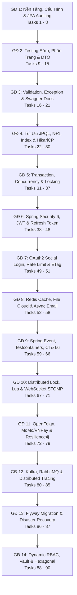

# 🧭 LỘ TRÌNH SPRING BOOT ENTERPRISE THỰC CHIẾN (90 TASKS — 14 GIAI ĐOẠN)
*(Chuẩn Single Responsibility & Khung Tư Duy 5 Chiều — Bậc Thang Độ Khó $\le 20\%$)*

> **🎯 4 Quy Chuẩn Thiết Kế Bất Biến:**
> 1. **1 Task = Đúng 1 Mục Tiêu Duy Nhất (Single Focus):** Không nhồi nhét, không pha trộn nhiều khái niệm trong 1 bài toán.
> 2. **Ngưỡng thử thách chuẩn $\le 20\%$:** Mỗi bước tiến lên một nấc thang tự nhiên, chuyển tiếp êm ái, loại bỏ hoàn toàn hiện tượng "nhảy cóc" kiến thức.
> 3. **100% Thực hành (Coding-First):** Mọi câu hỏi đều gắn liền với file code và hành động cụ thể trong dự án.
> 4. **Khung Tư Duy 5 Chiều (5D Framework):** Mỗi bài toán đều được soi chiếu qua 5 lăng kính kỹ sư:
>    - 🔬 *[Bản chất]:* Cơ chế hoạt động ngầm (Under the hood) của JVM, Spring Container và Database.
>    - ⚠️ *[Rủi ro / Bảo mật / Bẫy lỗi]:* Những lỗi ngầm, lỗ hổng bảo mật (OWASP), hoặc thảm họa tải cao (OOM, Deadlock).
>    - ⚖️ *[So sánh / Cơ chế]:* Đặt lên bàn cân các giải pháp kỹ thuật tương đương để hiểu rõ lý do lựa chọn.
>    - 🔄 *[Đánh đổi (Trade-offs)]:* Mọi quyết định kỹ thuật đều có giá phải trả (Read vs Write, CPU vs RAM, Tốc độ vs Tính nhất quán).
>    - 🏢 *[Thực tế / Thực hành]:* Áp dụng trực tiếp vào dự án, kiểm chứng bằng log, test hoặc công cụ đo lường.

---

## 🗺️ MỤC LỤC TỔNG QUAN 14 GIAI ĐOẠN (90 TASKS)

---

## 📚 DANH SÁCH 4 PHẦN TÀI LIỆU CHI TIẾT (FULL 5D FRAMEWORK)

Chi tiết hành động code, mục tiêu duy nhất và bộ 5 câu hỏi tư duy kỹ sư cho từng task được biên soạn đầy đủ tại 4 tài liệu chuyên sâu:

| Tập tin chi tiết | Giai đoạn bao hàm | Phạm vi Task | Trọng tâm kỹ thuật |
| :--- | :--- | :--- | :--- |
| **[PHẦN 1: NỀN TẢNG, TESTING SỚM & API DOCS](file:///Users/kyanh/Documents/Learn/learn_spring/docs/ROADMAP_PHAN1_Tasks1-21_NenTang.md)** | Giai đoạn 1 $\rightarrow$ 3 | **Tasks 1 - 21** | YAML Profiles, BaseEntity, Soft Delete, Seeder, JUnit 5, Mockito, Pageable, Custom Validation, Swagger OpenAPI, MockMvc, MDC Log. |
| **[PHẦN 2: TRUY VẤN, CONCURRENCY & BẢO MẬT](file:///Users/kyanh/Documents/Learn/learn_spring/docs/ROADMAP_PHAN2_Tasks22-51_TruyVan_BaoMat.md)** | Giai đoạn 4 $\rightarrow$ 7 | **Tasks 22 - 51** | JPQL, N+1 Query, Specification, HikariCP, Concurrency Lost Update, Optimistic/Pessimistic Lock, Deadlock, Security 6, JWT, Refresh Token Rotation, Account Lockout, OAuth2, HTTP ETag. |
| **[PHẦN 3: CACHING, ASYNC, DEVOPS & REALTIME](file:///Users/kyanh/Documents/Learn/learn_spring/docs/ROADMAP_PHAN3_Tasks52-71_Cache_Docker_CICD.md)** | Giai đoạn 8 $\rightarrow$ 10 | **Tasks 52 - 71** | Redis Cache, Magic Bytes Upload, Cloudinary, Async Email Reset Password, Spring Event, Testcontainers PostgreSQL, JaCoCo CI, Actuator, Sentry, Graceful Shutdown, Docker Compose, k6 Load Test, GitHub Actions CI, Redisson Distributed Lock, Lua Script, WebSocket STOMP. |
| **[PHẦN 4: FINTECH, KAFKA, RESILIENCE & KIẾN TRÚC](file:///Users/kyanh/Documents/Learn/learn_spring/docs/ROADMAP_PHAN4_Tasks72-90_NangCao.md)** | Giai đoạn 11 $\rightarrow$ 14 | **Tasks 72 - 90** | OpenFeign, MoMo/VNPay HMAC, IPN Webhook, Resilience4j Circuit Breaker & Bulkhead, Idempotency Engine, VietQR, Kafka DLQ, RabbitMQ Topic Exchange, Micrometer Distributed Tracing, Outbox Pattern, Reconciliation 3 bên, Flyway, Backup DR Plan, Reflection RBAC, Vault, Hexagonal Architecture. |

---

## 📑 TỔNG HỢP CHI TIẾT 90 TASKS THEO 14 GIAI ĐOẠN

### 🏗️ Giai Đoạn 1: Chuẩn Hóa Cấu Hình, Log SQL & Tầng Dữ Liệu Cơ Bản (Tasks 1 - 8)
- **Task 1:** Cấu hình `application.yml` đa môi trường & chuẩn hóa URL `/api/v1/`
- **Task 2:** Cấu hình & học cách đọc log SQL Hibernate trong `application-dev.yml` *(Kỹ năng sống còn)*
- **Task 3:** Chuẩn hóa Dependency Injection bằng Constructor (`@RequiredArgsConstructor`)
- **Task 4:** Tạo Class trừu tượng `BaseEntity` (`@MappedSuperclass`, `createdAt`, `updatedAt`)
- **Task 5:** Cấu hình JPA Auditing tự động điền thời gian (`@EnableJpaAuditing`)
- **Task 6:** Kế thừa `BaseEntity` cho các Entity nghiệp vụ (`Category`, `Product`, `Customer`, `Order`)
- **Task 7:** Thêm cờ xóa mềm (`isDeleted`) & tự động hóa với `@SQLDelete` và `@SQLRestriction`
- **Task 8 (MỚI):** Tự động seed dữ liệu mẫu cho dev với `CommandLineRunner` & Java Faker

### 🧪 Giai Đoạn 2: Testing Sớm, Phân Trang & Sắp Xếp Dữ Liệu (Tasks 9 - 15)
- **Task 9:** Viết Unit Test JUnit 5 cho `CategoryMapper` *(Bắt đầu test sớm)*
- **Task 10:** Viết Unit Test Mockito cho `CategoryServiceImpl` *(Học Mockito sớm)*
- **Task 11:** Thiết kế Generic DTO `PageResponse<T>`
- **Task 12:** Tích hợp `Pageable` vào tầng Repository & Service
- **Task 13:** Thêm endpoint phân trang ở Controller & giới hạn kích thước trang
- **Task 14:** Xử lý ngoại lệ tham số sắp xếp không hợp lệ (`PropertyReferenceException`)
- **Task 15:** Bổ sung Validation định dạng cho `CustomerRequest` (`@NotBlank`, `@Email`)

### 🛡️ Giai Đoạn 3: Custom Validation, Exception Chuẩn & API Docs (Tasks 16 - 21)
- **Task 16:** Tạo Custom Annotation `@PhoneNumber` và `ConstraintValidator`
- **Task 17:** Chuẩn hóa thông báo lỗi validation trong `GlobalExceptionHandler`
- **Task 18 (MỚI):** Tự động hóa tài liệu API với Swagger / OpenAPI (`springdoc-openapi`)
- **Task 19:** Viết Integration Test cho Controller với `MockMvc` (`@WebMvcTest`)
- **Task 20:** Bắt lỗi trùng lặp tầng Database (`DataIntegrityViolationException`)
- **Task 21:** Ghi log chuẩn (SLF4J) & tự động gắn `Trace-Id` với MDC Filter

### 🔍 Giai Đoạn 4: Tối Ưu Truy Vấn, N+1 & Tìm Kiếm Động (Tasks 22 - 30)
- **Task 22:** Viết câu truy vấn JPQL tùy biến đầu tiên với `@Query`
- **Task 23:** Viết câu JPQL tìm kiếm sản phẩm theo tên danh mục (JOIN)
- **Task 24:** Bắt & đo lường lỗi N+1 Query thực tế với Hibernate Statistics
- **Task 25:** Tối ưu bộ nhớ với DTO Projection (Interface & Constructor-based)
- **Task 26:** Làm quen với JPA Specification (Criteria API)
- **Task 27:** Thêm điều kiện lọc khoảng giá và tên vào `ProductSpecification`
- **Task 28:** Ghép nối Specification thành API tìm kiếm linh hoạt (`Specification + Pageable`)
- **Task 29:** Đánh Index Database và phân tích bằng `EXPLAIN ANALYZE`
- **Task 30 (MỚI):** Tối ưu Connection Pooling HikariCP & phát hiện Connection Leak

### ⚡ Giai Đoạn 5: Transaction, Quản Lý Trạng Thái & Xử Lý Tranh Chấp (Tasks 31 - 37)
- **Task 31:** Thiết kế luồng vòng đời trạng thái Đơn hàng (`OrderStatus` Finite State Machine)
- **Task 32:** Cơ chế Rollback của `@Transactional` & kịch bản lỗi giả lập
- **Task 33:** Viết test 2 luồng đơn giản tái hiện Bug trừ kho âm (Lost Update)
- **Task 34:** Khắc phục bằng Khóa Lạc Quan (Optimistic Lock với `@Version`)
- **Task 35:** Xử lý lỗi xung đột phiên bản & chiến lược thử lại (Spring Retry)
- **Task 36:** Khắc phục bằng Khóa Bi Quan (Pessimistic Lock với `SELECT FOR UPDATE`)
- **Task 37:** Nhận diện Deadlock & cấu hình khóa Timeout (`jakarta.persistence.lock.timeout`)

### 🔒 Giai Đoạn 6: Authentication, Authorization & Security Toàn Diện (Tasks 38 - 48)
- **Task 38:** Thiết kế Entity `User` và `Role` (RBAC tương thích `UserDetails`)
- **Task 39:** Cấu hình `PasswordEncoder` với `BCryptPasswordEncoder` (Salted Hash)
- **Task 40:** Xây dựng API Đăng ký tài khoản (`POST /api/v1/auth/register`)
- **Task 41:** Tích hợp thư viện JWT & viết `JwtTokenProvider`
- **Task 42:** Viết API Đăng nhập (`POST /api/v1/auth/login`)
- **Task 43 (MỚI):** Cơ chế Refresh Token Rotation & thu hồi token (Logout Blacklist với Redis)
- **Task 44 (MỚI):** Khóa tài khoản tự động sau N lần đăng nhập sai (Brute-Force Defense)
- **Task 45:** Viết `JwtAuthenticationFilter` (`OncePerRequestFilter`)
- **Task 46:** Cấu hình `SecurityFilterChain` trong Spring Security 6 (CORS, CSRF, Security Headers)
- **Task 47:** Phân quyền API với `@PreAuthorize` và SpEL (Method & Row-level Security)
- **Task 48:** Tùy biến lỗi 401 Unauthorized và 403 Forbidden theo chuẩn `ApiResponse`

### 🌐 Giai Đoạn 7: Bảo Mật Nâng Cao, OAuth2 & Rate Limiting (Tasks 49 - 51)
- **Task 49 (MỚI):** Đăng nhập bằng mạng xã hội với OAuth 2.0 (Google Login `CustomOAuth2UserService`)
- **Task 50:** Chống tấn công DoS & Brute-Force bằng Rate Limiting (Bucket4j)
- **Task 51 (MỚI):** Tối ưu băng thông với HTTP ETag & Conditional GET (304 Not Modified)

### ⚡ Giai Đoạn 8: Caching, File Storage & Bất Đồng Bộ (Tasks 52 - 58)
- **Task 52:** Tích hợp Redis & bật `@EnableCaching` (GenericJackson2JsonRedisSerializer)
- **Task 53:** Áp dụng `@Cacheable` và `@CacheEvict` cho Danh mục
- **Task 54:** Cache dữ liệu chi tiết Sản phẩm kèm Key động (`@Cacheable(key = "#id")`)
- **Task 55:** Kiểm tra bảo mật File Upload (Magic Bytes Apache Tika & chống Path Traversal)
- **Task 56:** Tích hợp Cloud Storage (Cloudinary / MinIO SDK) cho ảnh sản phẩm
- **Task 57:** Bật tính năng chạy ngầm bất đồng bộ (`@EnableAsync` & `ThreadPoolTaskExecutor`)
- **Task 58 (MỚI):** Xây dựng luồng Quên/Đặt lại mật khẩu bằng Email Async

### 🧪 Giai Đoạn 9: Event-Driven Nội Bộ, Docker & Testing Nâng Cao (Tasks 59 - 66)
- **Task 59:** Tách rời logic bằng Spring Event (`ApplicationEventPublisher` & `@TransactionalEventListener`)
- **Task 60:** Nâng cấp Integration Test với Testcontainers (Test PostgreSQL thật)
- **Task 61 (MỚI):** Đo độ phủ kiểm thử với JaCoCo & thiết lập Quality Gate CI
- **Task 62:** Tích hợp Health Check & Metrics với Spring Boot Actuator
- **Task 63 (MỚI):** Bắt & báo cáo lỗi tập trung với Sentry SDK
- **Task 64 (MỚI):** Triển khai cơ chế Graceful Shutdown khi deploy ứng dụng
- **Task 65:** Đóng gói ứng dụng với Multi-stage Docker & Docker Compose
- **Task 66 (MỚI):** Kiểm thử hiệu năng & tải trọng hệ thống bằng k6 (Load Testing)

### 🚀 Giai Đoạn 10: CI/CD Pipeline, Khóa Phân Tán & Realtime (Tasks 67 - 71)
- **Task 67:** Tự động hóa CI/CD Pipeline với GitHub Actions
- **Task 68:** Khóa phân tán (Distributed Lock) với Redisson
- **Task 69:** Rate Limiting phân tán bằng Redis Lua Script nguyên tử
- **Task 70:** Thông báo biến động số dư Realtime qua WebSocket STOMP & Redis Pub/Sub
- **Task 71:** Tổng hợp Redis nâng cao — Pipeline, TTL Strategy & Monitoring

### 💳 Giai Đoạn 11: Tích Hợp Dịch Vụ Ngoài, Cổng Thanh Toán & Resilience (Tasks 72 - 79)
- **Task 72 (MỚI):** Giao tiếp giữa các dịch vụ với OpenFeign / RestClient
- **Task 73:** Tích hợp cổng thanh toán MoMo / VNPay & ký chữ ký số HMAC-SHA256
- **Task 74:** Xử lý IPN (Instant Payment Notification) Webhook & chống giả mạo
- **Task 75 (MỚI):** Bảo vệ ứng dụng khỏi sự cố đối tác bằng Resilience4j (Circuit Breaker & Bulkhead)
- **Task 76:** Xây dựng Engine xử lý yêu cầu đơn định (Idempotency Key Engine)
- **Task 77:** Tích hợp tài khoản định danh (Virtual Account / VietQR chuyển khoản tự động)
- **Task 78:** Giới thiệu Hexagonal Architecture qua bài toán Payment
- **Task 79:** Áp dụng Strategy & Adapter Pattern thiết kế hệ thống đa cổng thanh toán

### 📨 Giai Đoạn 12: Message Broker, Kafka & Distributed Tracing (Tasks 80 - 85)
- **Task 80:** Tích hợp Apache Kafka — Producer, Consumer & Partitioning cơ bản
- **Task 81:** Xử lý lỗi Kafka & xây dựng Dead Letter Queue (DLQ)
- **Task 82:** RabbitMQ & Topic Exchange — So sánh thực chiến với Kafka
- **Task 83 (MỚI):** Giám sát luồng phân tán với Micrometer Tracing & OpenTelemetry (Distributed Tracing)
- **Task 84:** Đảm bảo không mất Event bằng Transactional Outbox Pattern
- **Task 85:** Xây dựng Engine đối soát dữ liệu tài chính (Reconciliation Engine)

### 🗄️ Giai Đoạn 13: Quản Trị Dữ Liệu, Migration & Sao Lưu Phục Hồi (Tasks 86 - 87)
- **Task 86:** Database Migration chuyên nghiệp với Flyway
- **Task 87 (MỚI):** Chiến lược sao lưu tự động (Backup) & phục hồi thảm họa (Disaster Recovery)

### 🏛️ Giai Đoạn 14: Spring Internals, Tối Ưu Sâu & Kiến Trúc Cấp Cao (Tasks 88 - 90)
- **Task 88:** Tự động quét metadata endpoint bằng Reflection & Dynamic RBAC
- **Task 89:** Bảo mật cấu hình nâng cao với Dynamic Secret Manager / Vault
- **Task 90:** Tái cấu trúc hoàn chỉnh 1 Module sang Hexagonal Architecture (Ports & Adapters)

---

## 🔄 BẢNG ÁNH XẠ ĐỐI CHIẾU VỚI LỘ TRÌNH TYPESCRIPT BACKEND

Dưới đây là bảng đối chiếu giúp lập trình viên hiểu rõ sự tương đồng và điểm khác biệt kiến trúc giữa thế giới Node.js/TypeScript và Spring Boot Enterprise:

| Lĩnh vực | Kỹ thuật trong TypeScript / Node.js | Kỹ thuật tương đương trong Spring Boot | Task trong lộ trình |
| :--- | :--- | :--- | :--- |
| **API & Routing** | Express Router, ts-node | Spring MVC `@RestController`, `@RequestMapping` | Task 1 |
| **Dependency Injection** | InversifyJS / TypeDI / NestJS | Spring IoC Container & Constructor Injection | Task 3 |
| **ORM & Data Modeling** | TypeORM `@Entity()`, Decorators | Hibernate / JPA `@Entity`, `@Table`, `@Column` | Task 4, 6, 38 |
| **Validation** | Zod / Joi / class-validator | Jakarta Bean Validation, Custom `ConstraintValidator` | Task 15, 16 |
| **Error Handling** | Error Middleware `(err, req, res, next)` | `@RestControllerAdvice` & `@ExceptionHandler` | Task 17, 48 |
| **Documentation** | Swagger UI Express / tsoa | `springdoc-openapi-starter-webmvc-ui` | Task 18 |
| **Database Pool** | pg-pool / generic-pool | HikariCP High-Performance Pool & Leak Detection | Task 30 |
| **Concurrency Control** | Optimistic Lock / `SELECT FOR UPDATE` | `@Version` Optimistic & `@Lock(PESSIMISTIC_WRITE)` | Task 34, 36 |
| **Security & Auth** | jsonwebtoken, bcrypt, Passport.js | Spring Security 6, `BCryptPasswordEncoder`, JWT | Task 39 - 46 |
| **OAuth2 Social** | Passport Google OAuth2 strategy | `spring-boot-starter-oauth2-client` | Task 49 |
| **Rate Limiting** | express-rate-limit / Redis token bucket | Bucket4j & Redis Lua Script Atomic Token Bucket | Task 50, 69 |
| **HTTP Caching** | ETag middleware, `fresh` | `ShallowEtagHeaderFilter` & Conditional GET 304 | Task 51 |
| **Cache Layer** | ioredis, node-cache | Redis Cache, `@Cacheable`, `@CacheEvict` | Task 52, 53, 54 |
| **Async & Background** | BullMQ / Celery worker | `@EnableAsync`, `ThreadPoolTaskExecutor`, Spring Event | Task 57, 59 |
| **Testing Suite** | Jest, Supertest, Cypress | JUnit 5, Mockito, MockMvc, Testcontainers | Task 9, 10, 19, 60 |
| **Coverage Quality Gate** | Istanbul / c8 coverage threshold | JaCoCo Maven Plugin `<rule>` check in CI | Task 61 |
| **Monitoring & Sentry** | `@sentry/node`, Prometheus client | Spring Boot Actuator, Micrometer, Sentry SDK | Task 62, 63 |
| **Deployment** | Multi-stage Docker, PM2 graceful | Multi-stage Dockerfile, `server.shutdown=graceful` | Task 64, 65 |
| **Load Testing** | k6, Artillery, Autocannon | k6 Load Testing (RPS, P95, P99 Latency) | Task 66 |
| **Distributed Lock** | Redlock-node | Redisson Distributed Lock & Lua Watchdog | Task 68 |
| **Realtime Web** | Socket.IO, ws | Spring WebSocket STOMP + Redis Pub/Sub | Task 70 |
| **Inter-service HTTP** | axios, undici, NestJS HttpService | Spring Cloud OpenFeign / Spring 6 RestClient | Task 72 |
| **Fault Tolerance** | opossum (circuit breaker), async-retry | Resilience4j `@CircuitBreaker` & `@Bulkhead` | Task 75 |
| **Message Broker** | kafkajs, amqplib (RabbitMQ) | Spring Kafka, Spring AMQP (Topic Exchange) | Task 80, 81, 82 |
| **Tracing** | OpenTelemetry JS SDK | Micrometer Tracing + OpenTelemetry / Zipkin | Task 83 |
| **Data Migration** | TypeORM Migration / Umzug | Flyway Database Migration (`V1__...`) | Task 86 |
| **Clean Architecture** | Clean Architecture / Ports & Adapters | Hexagonal Architecture (Domain - Ports - Adapters) | Task 78, 90 |

---

## 🏆 ĐẶC QUYỀN CHỈ CÓ TẠI SPRING BOOT ROADMAP NÀY
So với các lộ trình backend thông thường, lộ trình này trang bị thêm **6 bài toán doanh nghiệp thực chiến cấp cao** trích xuất từ hệ thống thực tế:
1. **Engine Xử Lý Đơn Định (Idempotency Key Engine - Task 76):** Giải quyết triệt để lỗi người dùng hoặc cổng thanh toán bắn webhook trùng lặp.
2. **Tài Khoản Định Danh & VietQR Động (Task 77):** Tự động hóa gạch nợ ngân hàng không cần đối soát thủ công.
3. **Mẫu Transactional Outbox (Task 84):** Giải quyết bài toán Dual-Write kinh điển, bảo đảm dữ liệu Event bắn ra Kafka luôn ACID 100% với Database.
4. **Engine Đối Soát Tài Chính 3 Chiều (Three-way Reconciliation - Task 85):** Thuật toán đối soát hàng trăm ngàn dòng giao dịch đêm với đối tác ngân hàng.
5. **Tự Động Quét Metadata Endpoint Bằng Reflection (Task 88):** Tự động đồng bộ cây phân quyền API vào DB mà không cần gõ migration tay.
6. **Bảo Mật Secrets Không Plaintext (Vault / Secret Manager - Task 89):** Tuân thủ tiêu chuẩn an toàn thông tin tài chính PCI-DSS.

---

👉 **Bắt đầu ngay hôm nay với [Task 1: Cấu Hình application.yml Đa Môi Trường & Chuẩn Hóa URL /api/v1/](file:///Users/kyanh/Documents/Learn/learn_spring/docs/ROADMAP_PHAN1_Tasks1-21_NenTang.md#task-1-c%E1%BA%A5u-h%C3%ACnh-applicationyml-%C4%91a-m%C3%B4i-tr%C6%B0%E1%BB%9Dng--chu%E1%BA%A9n-h%C3%B3a-url-apiv1)!**
